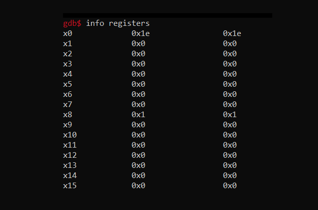

<h1>aarch64 Assembly</h1>
<h3>Baby Steps</h3>

<h2>Introduction</h2>

This project is long overdue. I've been developing applications for devices that contain ARMv8 processors for a long time, and I have wanted to break into the assembly language. Here we go!

<h2>Raspberry Pi 3</h2>

For this project, I chose to use a Raspberry Pi 3 for development. I figured I could cross-compile and then use qemu or something else, but I found that I was happier with just spinning up a RPI, connecting it to the network, and accessing the device via a secure shell (ssh).

With all this in mind, I'm running Fedora Minimal 37 on the Rasperry Pi 3, and will outline several of the packages I selected to assemble, link, and test this project, as well as debug it with GCC.

<h2>Assembling</h2>

<code>as -g -o &lt;filename&gt;.o &lt;filename&gt;.s -march=armv8-a</code>

<h2>Linking</h2>

<code>ld -o &lt;filename&gt; &lt;filename&gt;.o</code>

<h2>Debugging with GDB</h2>

<code>gdb &lt;filename&gt;</code>

<code>b _start</code>

<code>r</code>

<code>info registers</code>

<code>stepi</code> or <code>nexti</code> (step into or step over)

Note, if you would like to see the effect of your code, use <code>stepi</code>. If you would like to skip a line, use <code>nexti</code>.

Here are some useful GDB commands:

<ul>
<li><code>start</code>: start the program and pause before executing the first instruction.</li>
<li><code>run</code>: start the program and continue to the next breakpoint, if any.</li>
<li><code>break</code>: set a breakpoint at a line or address where you want to pause the program.</li>
<li><code>delete</code>: delete a breakpoint.</li>
<li><code>info break</code>: show all breakpoints.</li>
<li><code>continue</code>: continue the program until the next breakpoint.</li>
<li><code>next</code>: execute the next line of source code (step over function calls).</li>
<li><code>step</code>: execute the next line of source code (step into function calls).</li>
<li><code>finish</code>: continue execution until the current function returns.</li>
<li><code>print</code>: display the value of a variable or expression.</li>
<li><code>display</code>: display the value of a variable or expression after each step or continue.</li>
<li>x/nfu addr: examine the memory at a given address, with the following options:
    <ul>
    <li>n: number of units to display (default is 1).</li>
    <li>f: format (e.g. x for hexadecimal).</li>
    <li>u: unit size (e.g. b for byte, w for word, g for giant).</li>
    </ul>
</li>
<li>info registers: display the contents of all registers.</li>
<li>info registers register: display the contents of a specific register (e.g. info registers x0).</li>
<li>layout asm: show the source code and assembly code side-by-side.</li>
<li>layout reg: show the source code and register contents side-by-side.</li>
<li>layout split: show the source code, assembly code, and register contents in separate windows.</li>
<li>quit: exit gdb.</li>
</ul>

<h2>Note on ARMv7 vs ARMv8</h2>

 
